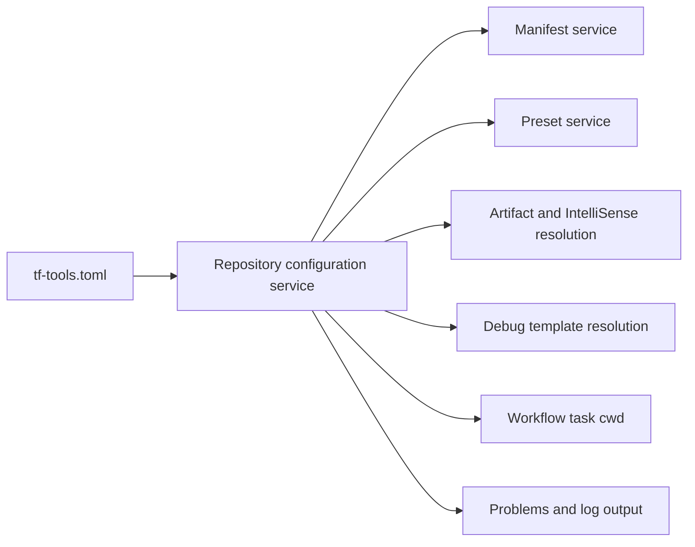

# Data Model: Repository Configuration File

## Repository Configuration File

The optional root-level `tf-tools.toml` is a committed TOML document. Only its `[paths]` table belongs to this feature.

| Field | Type | Default when absent or empty | Empty-value behavior | Notes |
| --- | --- | --- | --- | --- |
| `paths.cargo-workspace` | string | `core/embed` when absent | Workspace root | Current working directory for workflow tasks. |
| `paths.debug-templates` | string | `core/embed/xtask/tf-tools/debug` | Built-in default | Directory containing debug templates. |
| `paths.build-artifacts` | string | `core/build-xtask/artifacts` | Disabled | Empty string disables artifact-based IntelliSense resolution. |
| `paths.manifest` | string | `core/embed/xtask/tf-tools/manifest.yaml` | Built-in default | Manifest file location. |
| `paths.presets` | string | `core/embed/xtask` | Built-in default | Direct parent of `presets.toml` and `user-presets.toml`. |

Each non-empty relative value is resolved against the workspace root. Each absolute value is used unchanged. Variable-reference-like text is retained literally. Unsupported `[paths]` keys are ignored. A non-string value for a supported field makes the file invalid.

## Resolved Repository Configuration

| Field | Type | Derived from | Used by |
| --- | --- | --- | --- |
| `configurationUri` | URI | `<workspace root>/tf-tools.toml` | Watching, diagnostics, logs |
| `cargoWorkspacePath` | absolute filesystem path | `paths.cargo-workspace` | Build, Clippy, Check, Clean, Flash to Device, Upload to Device |
| `debugTemplatesPath` | absolute filesystem path | `paths.debug-templates` | Start Debugging and Run and Debug provider |
| `artifactsPath` | absolute filesystem path or empty string | `paths.build-artifacts` | Artifact rows, artifact actions, IntelliSense |
| `manifestUri` | URI | `paths.manifest` | Manifest service |
| `presetUris` | shared and user URIs | `paths.presets` | Preset service |

## Repository Configuration State

| State | Fields | Transition trigger | Required behavior |
| --- | --- | --- | --- |
| `absent` | Resolved defaults and configuration URI | `tf-tools.toml` does not exist | Extension remains operational using defaults. |
| `loaded` | Resolved configuration, configuration URI, load time | Valid file read or corrected file | All dependent services run from the new snapshot. |
| `invalid` | Configuration URI, validation issues, load time | Unreadable file, TOML parse failure, invalid `[paths]` table, or wrong supported entry type | Diagnostics, error notification, and log output are published; path-dependent state is cleared and workflows are blocked. |

The only allowed transitions are `absent <-> loaded`, `absent -> invalid`, `loaded -> invalid`, and `invalid -> absent|loaded|invalid` after a file-system event or explicit reload. An invalid state never retains a prior resolved configuration.

## Relationships

